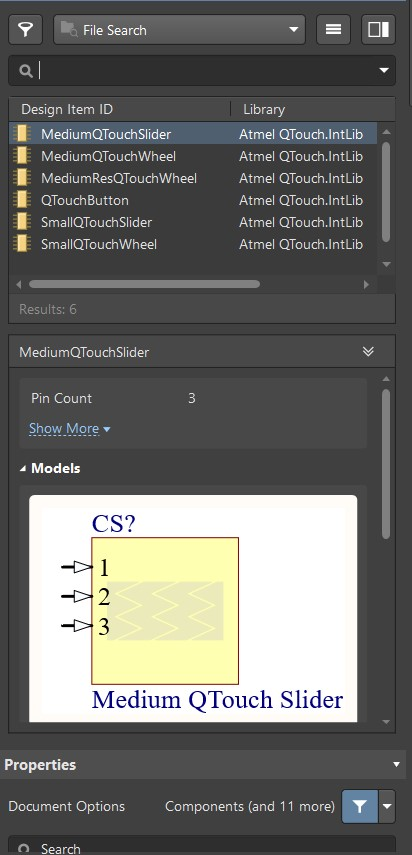
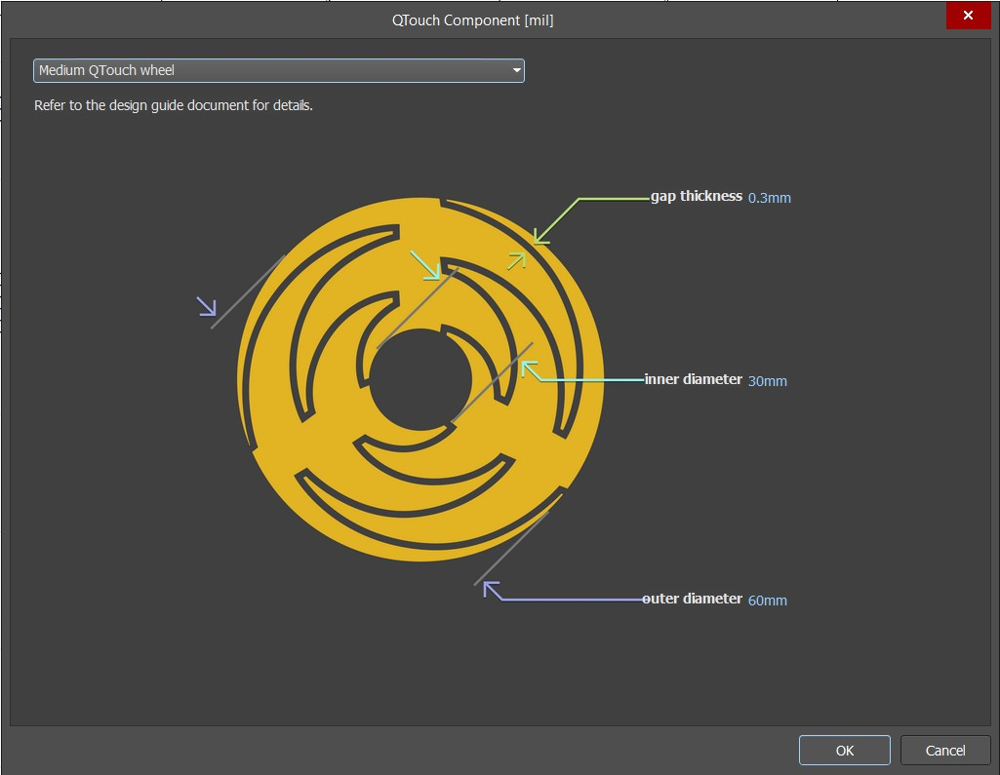
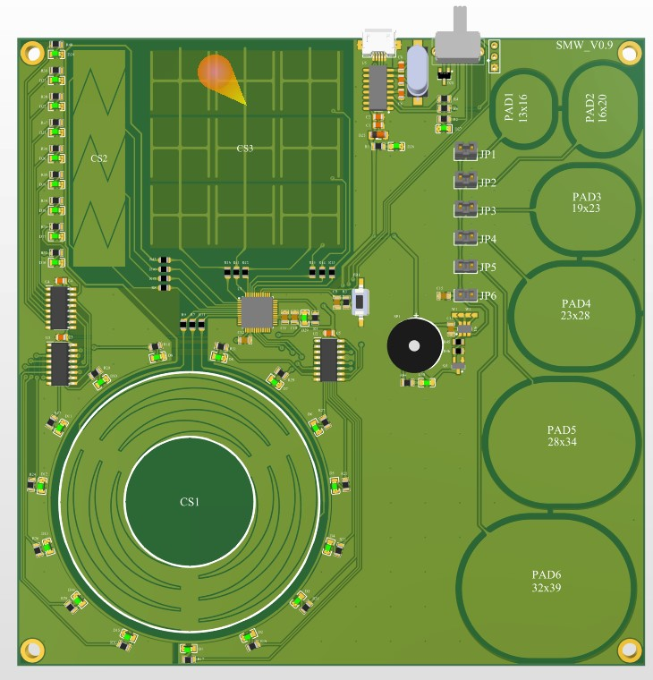
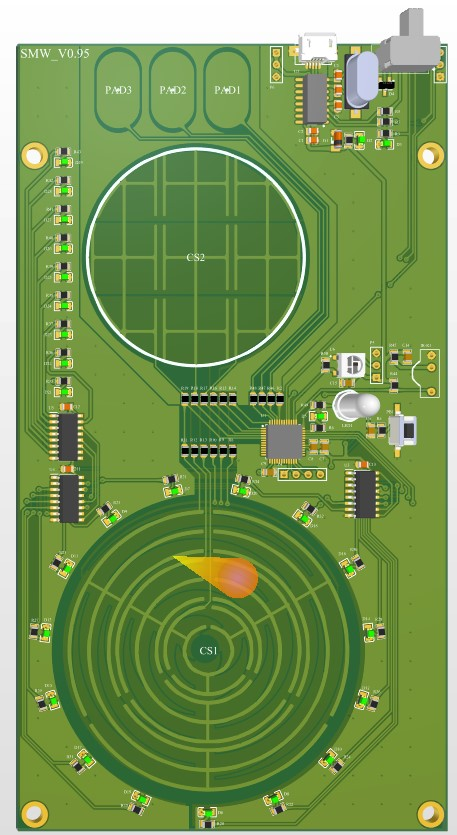
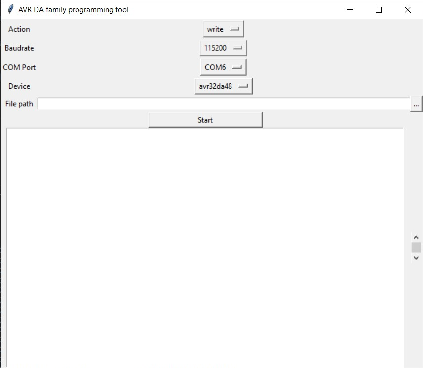
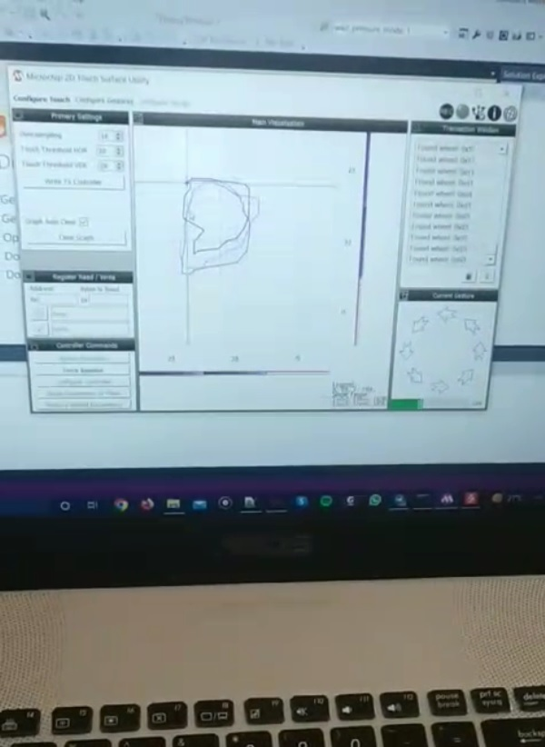

# Qtouch Development Board
This project is a test setup to explore touch sensors for use in other embedded projects. This project is powered by Microchip [Qtouch Library](https://www.microchip.com/en-us/development-tool/atmel-qtouch-library) which is a software library for developing touch applications on most AVR microcontrollers. The AVR chips that have PTC peripherals, can utilize this library to implement a hardware touch detector sensor. For this project, I had my hand on an AVR32DA48 chip which is a new generation of AVR chips redesigned by Microchip. This library supports not only touch buttons but liner sliders and wheels too. 

Two PCBs are designed using Altium Designer. The slider, wheels, and 2D surfaces are implemented by [Altium Qtouch Component](https://www.altium.com/documentation/altium-designer/atmeltouch-dlg-dialog-configurator-avrtouchqtouch-component-ad?version=22). When installing the altium designer you can check to install this part too. You can find Qtouch components by just searching Qtouch in the Altium library search.



After placing the component, right mouse clock on the component and select configure and a window like the picture below will pop up.



Two iterations of the setup are designed for testing the different features of the library. In the first one TTP223 chip is placed and could be connected to 6 differently sized pads via some jumpers. This chip was implemented in on the first PCB to compare different touch options. One 2D surface, one wheel, and one lider are placed on the PCB alongside 24 LEDs that could be driven to visualize the touch status. The LEDs are driven with 74HC595 shift register IC. A CH340g USB to Serial chip is also used for programming and debugging the code.



For the second PCB 2 different novel circular 2D touch surfaces are designed to be tested. Also, 3 touch pads are connected directly to the AVR chip.



## Software
I used the Atmel Studio IDE and [Atmel START](https://start.atmel.com/) code generator for setting up the microcontroller and the Qtouch sensors. It is pretty easy and straightforward, just add the Qtouch software library to the project using the Atmel START wizard.

These new AVR chips use UPDI protocol to program the code on the chip. I used the CH340 IC and a piece of python script called [SerialUPDI](https://github.com/SpenceKonde/AVR-Guidance/blob/master/UPDI/jtag2updi.md), written by `Spence Konde` and `Quentin Bolsee` to directly program the avr chip. The script is in the `Programmer Tool` folder called `prog.py`. The instruction to use the script is below.
```
usage: prog.py [-h] [-a ACTION] [-b BAUDRATE] [-wc WRITE_CHUNK] [-rc READ_CHUNK] [-d DEVICE] [--fuses FUSES [FUSES ...]] [--fuses_print] [-f FILENAME] [-wd WRITEDELAY]
               [-t TOOL] [-u UART] [-v]

optional arguments:
  -h, --help            show this help message and exit
  -a ACTION, --action ACTION
                        Action to perform {write, read, erase}.
  -b BAUDRATE, --baudrate BAUDRATE
                        Serial baud rate, if applicable, (default: 115200). 115200 should work with all configurations and adapters, and 230400 works with all windows.  
                        Non-ch340 adapters on linux/mac may need -wd 1. 460800 needs -wd 1 except for CH340 on all platforms. CH340 USB latency is high enough that      
                        even 921600 works without -wd.
  -wc WRITE_CHUNK, --write_chunk WRITE_CHUNK
                        Max number of bytes of serial data to write per usb packet. -1 (whole page) is recommended. (Default: -1 (no write chunking)) Intended as        
                        workaround for specific serial adapters. (ex: HT42B345, which can't do 345600 can program Dx at 460800 and 32b chunk size), and has a profound   
                        negative impact on write performance.
  -rc READ_CHUNK, --read_chunk READ_CHUNK
                        Max number of bytes to request from the device at a time when reading or verifying. Default: -1 (maximum 512b on all existing parts). This is    
                        intended as a workaround for specific serial adapters, and it's use greatly degrades read performance.
  -d DEVICE, --device DEVICE
                        Part number, lowercase (e.g. attiny412, ...).
  --fuses FUSES [FUSES ...]
                        List of offset:value (0x, 0b or decimal). Formats can be mixed and matched within the same command for different fuses, for example: --fuses     
                        0:0x00 1:0x00 2:0x02 5:0b11111111 6:0x04
  --fuses_print         Print fuse values.
  -f FILENAME, --filename FILENAME
                        Hex file to read/write.
  -wd WRITEDELAY, --writedelay WRITEDELAY
                        Page write delay [ms] for tinyAVR and megaAVR. Needed at higher baud rates, particularly on non-windows platforms. (Default: 0 - this severely   
                        impacts write performance)
  -t TOOL, --tool TOOL  Options other than 'uart' are not valid - this is SerialUPDI. If using the USB programmers, use avrdude or pymcuprog
  -u UART, --uart UART  Serial port to use if tool is uart.
  -v, --verbose         Display more info (can be repeated). -v adds INFO messages, while -v -v also shows DEBUG messages.
```

Using the script from the command line was a little inconvenient, so I wrote a little Python script to launch a GUI to be able to use the main script. It is called `prog_GUI.exe`.



For debugging 2D surfaces, microchip offers software called `2D Touch Surface Utility` which you can download from [Microchip website](https://www.microchip.com/en-us/products/touch-and-gesture/mcus-on-chip-touch/2d-touchpads/2d-touch-surface-library). This software communicated with designed PCB via UART and show the coordinates and the gestures of finger movements. In the picture below you can see debugging the code and showing the touch coordinates in the software.

